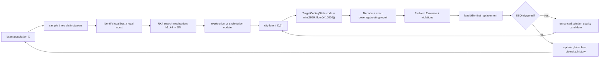

# 2021–2026 超啟發式演算法機制盤點與導入建議

> 調查截止日：2026-07-31  
> 專案範圍：`codes/2023以恩MWSN`  
> 本文件只做程式盤點、文獻調查、機制比對與設計規劃；未新增、刪除或修改任何正式演算法程式。

## 判讀原則

1. 「現有演算法」以目前工作區中的 `.py` 原始碼為準，不以檔名、舊文件或 `.pyc` 為準。
2. `Algorithm2/` 是組合式替代架構，重現 `ALNS`、`GA`、`GOMEA` 與 `SE` 等既有家族；不重複計為新的數學演算法。
3. 文獻年份採正式出版年；若 online-first 與卷期年份不同，會同時標示。
4. 原論文自己做的 benchmark 不是「獨立驗證」。找不到獨立、同預算重現時明確寫「未確認」。
5. 重複度是「搜尋機制重複度」，不是名稱相似度：0 表示幾乎沒有共同核心，5 表示現有程式已實作或僅換隱喻。4–5 不列入新增優先候選。

---

## 1. 現有演算法完整盤點

### 1.1 專案實際解的問題

本專案的單回合決策不是單純 coverage，而是聯合決定：

- 每個 sensor 是否啟用以及 sensing level：`state.sch[sensor_id]`，0 為關閉，1–5 對應半徑 3、6、9、12、15。
- 每個啟用 sensor 的下一跳：`state.rou[sensor_id]`，最終必須到 base station。
- forwarding load：`state.use[sensor_id]`，由所有資料路徑累積。
- 某些外層 round 可在電量不足或覆蓋失敗時移動 sensor；移動成本是距離乘 0.1。移動是 `MobilityService` 的跨回合機制，不是大部分內層最佳化演算法的 decision variable。

覆蓋矩陣為 `connect[target, sensor, level]`；候選集 `CCS[target]` 保存可覆蓋該 target 的 `(sensor, level)`。路由只允許朝 BS 較近的節點前進，解碼器再依剩餘 capacity、距離與負載選下一跳，因此連通與 forwarding capacity 同時影響可行性。

能量模型：

- sensing cost：離散 level 使用 `LEVEL_RANGE² × sch_cof`；連續半徑版本直接使用 `radius² × sch_cof`。
- transmission：距離 `d <= 87` 時為 `amp[0] × packet × d²`，否則為 `amp[1] × packet × d⁴`，另加電子電路收發成本。
- 總成本為 sensing + routing；任何 sensor 的 `J - cost < 0` 都是 energy failure。

`FitnessService.evaluate_state` 回傳三個加權最大化分數：

1. `0.15 ×` 所有 target 周邊加權剩餘能量比例；
2. `0.25 ×` 最弱 target 的剩餘能量比例；
3. `0.60 ×` coverage ratio。

若有 energy failure，直接回傳 `(-1, -5, -1)`。不同演算法另外使用 uncovered targets、energy-failed sensors、disconnected sensors 的數量做 feasibility-first ranking、penalty 或 repair。這代表新增演算法不能只比較 `sum(fitness)`；否則可能讓不可行但表面分數較高的解混入更新。

主要 solution encoding：

- `CodingState`：長度 `2 × SENSOR_NUMBER` 的 sensor-based 整數碼；同時承載 schedule 與 routing preference。
- `TargetCodingState`：長度 `TARGET_NUMBER`、每基因 0–9999 的 target random-key；高位選 coverage candidate，低位決定 target priority，解碼後移除冗餘 sensor 並建立 route。
- `CriticalPatternCoding`：target cluster pattern、critical-target override 與 5 個 route-policy genes 的結構化編碼，解碼後回傳共用 `State`。
- `ScheduleState`／`CBGWO_State`：只優化 schedule 或 routing 的舊式專用狀態。

證據位置：`Problem/Problem.py`、`Problem/services/{coverage,energy,fitness,routing,mobility}_service.py`、`State/{SensorCoding,TargetCoding,CriticalPatternCoding,State}.py`。

### 1.2 現有演算法表

表中「使用」分成：**runner**（列在 `experiment_algorithms.py::ALGORITHM_NAMES`）、**source-only**（有完整原始碼但未列入該 runner）、**legacy/incomplete**（舊介面或不能由統一 runner 直接完成搜尋）。

| 正式名稱／類別 | 路徑與入口 | 使用 | 家族與 encoding | 搜尋單位 | 核心更新、探索與開發 | 選擇／接受 | 限制處理 | 關係與程式證據 |
|---|---|---:|---|---|---|---|---|---|
| Adaptive Large Neighborhood Search (`ALNS`) | `Algorithm/Combine/ALNS.py::ALNS` | runner | destroy-repair；`CodingState` | 單解 | random/low-energy/overlap/bottleneck destroy；coverage/energy/route repair；operator roulette 自適應 | 同可行 tier 用 SA；跨 tier feasibility-first | 專用 repair、冗餘 sensor 移除 | 已是強 local search／repair 框架 |
| CMA-MAE (`CMA_MAE`) | `Algorithm/Combine/CMA_MAE.py::CMA_MAE` | runner | quality-diversity + CMA-ES；`TargetCodingState` random-key | 多 emitter + archive | Gaussian sampling；mean/covariance/step-size 更新；archive threshold improvement；stagnation restart | 每個 CVT/grid cell 保留較優解 | 解碼 repair + feasibility-first | 與單純 CMA-ES 不同；已有 archive/restart |
| Differential MAP-Elites | `Algorithm/Combine/Differential_MAP_Elites.py::Differential_MAP_Elites` | runner | quality-diversity + DE；target random-key | archive elite | CVT descriptors 為 active ratio、bottleneck ratio；DE/rand/1/bin 產生 trial | cell-wise elitist replacement | 解碼 repair + feasibility-first | 專案已含 DE 型向量差分更新 |
| Genetic Algorithm (`GA`) | `Algorithm/Combine/GA.py::GA` | runner | GA；`CodingState` | population/chromosome | tournament、segment crossover、單基因 mutation | generational replacement | 主要依 decoder；scalar sum fitness | `BaseGA.py`；也是 RGA/SGA 的共同基底 |
| Particle Swarm Optimization (`PSO`) | `Algorithm/Combine/PSO.py::PSO` | runner | PSO；連續 latent → `CodingState` | particle | inertia + pbest + gbest；邊界截斷 | pbest/gbest greedy | floor random-key decode | `BasePSO.py`；KPSOO 同核心 |
| Estimation of Distribution Algorithm (`EDA`) | `Algorithm/Combine/EDA.py::EDA` | runner | univariate EDA；`CodingState` | population/model | 每 locus 類別機率獨立抽樣；top-α 更新 marginal | truncation selection | decoder | `BaseEDA.py`；未學習 linkage |
| Cuckoo Search (`CS`) | `Algorithm/Combine/CS.py::CS` | runner | Lévy-flight swarm；連續 latent → `CodingState` | nest | 單一隨機 gene 的 Lévy step；低排名 nests 重建 | global-best elitism + 重建 | floor decode | HRO/DO 的 Lévy 部分會與它重疊 |
| Northern Goshawk Optimization (`NSOA`) | `Algorithm/Combine/NSOA.py::NSOA` | runner | best-guided swarm；連續 position | population | natural-selection step、近 best reproduction、遞減 elimination | feasibility rank；淘汰最差後重生 | 種子涵蓋 CCS + feasibility rank | 代表「best attraction + reinitialization」家族 |
| Non-dominated Sorting GA-II (`NSGAII`) | `Algorithm/Combine/NSGAII.py::NSGAII` | runner | multi-objective EA；`TargetCodingState` | population | uniform-mask crossover、per-gene mutation | Pareto rank + crowding；parent+offspring elitism | uncovered/energy/disconnected violation-first | `BaseNSGAII.py` |
| Scheduling NSGA-II + route Q-learning (`SNSGAII`) | `Algorithm/Scheduling/SNSGAII.py::SNSGAII` | runner 名稱 `snsga_rqlearning` | NSGA-II + route RL；target encoding | population | NSGA-II 搜 schedule；`RQLearning` 選 route hop | Pareto/crowding | feasibility-first + route capacity | 組合演算法，不是全新的族 |
| Scheduling RIME (`SRIME`) | `Algorithm/Scheduling/SRIME.py::SRIME` | runner | RIME；`TargetCodingState` continuous genes | population | soft-rime 朝 best + noise；hard-rime 以遞增機率複製 best gene；mutation | elite retention、feasibility-first | sensing-radius repair + reroute | **2023 RIME 已實作** |
| GI-GOMEA | `Algorithm/Combine/GI_GOMEA.py::GI_GOMEA` | runner | linkage-model EA；`CodingState` | paired population/FOS | WSN graph + normalized MI 建 DSM/linkage tree；整個 FOS 交換 | pair acceptance 並保持 locus histogram | feasibility-first quality tuple | `BaseGIGOMEA.py`；不同於一般 GA |
| Target GI-GOMEA | `Algorithm/Combine/GI_GOMEA_Target.py::GI_GOMEA_Target` | runner | GI-GOMEA；`TargetCodingState` | paired population/FOS | target candidate-sharing graph + target linkage | 同上 | 同上 + target decode | GI-GOMEA encoding variant |
| Critical GI-GOMEA | `Algorithm/Combine/GI_GOMEA_Critical.py::GI_GOMEA_Critical` | runner | GI-GOMEA；`CriticalPatternCoding` | paired population/FOS | cluster/pattern/critical override/route genes 的 structural FOS | 同上 | structural decoder/repair；輸出共用 `State` | 最具 WSN problem structure 的 GOMEA variant |
| Search Economics (`CodingSE`) | `Algorithm/Combine/CodingSE.py::CodingSE` | runner | SE；`CodingState` | searcher × region goods | region alignment、segment crossover、1–3 gene mutation；市場期望值 | region tournament；searcher/good greedy | decoder + repair hook | `BaseSE.py` |
| Search Economics v2 (`CodingSEv2`) | `Algorithm/Combine/CodingSEv2.py::CodingSEv2` | runner | SE；`CodingState` | 同上 | 簡化 region 對位 + segment crossover + 1–3 mutation | 同 BaseSE | decoder/repair | CodingSE variant |
| SA-SETS | `Algorithm/Combine/SA_SETS.py::SA_SETS` | runner | sensor-aware SE/SETS；`CodingState` | searcher × sensor-derived regions | 以 BS 鄰近/基礎 coverage sensor 定義 region；crossover/mutation | 市場 belief + tournament + greedy | region alignment、decode | SETS 主幹之一；名稱中的 SA 不是一般 simulated annealing |
| Target SA-SETS | `Algorithm/Combine/SA_SETS_Target.py::SA_SETS_Target` | runner | SE/SETS；`TargetCodingState` | searcher × critical target region | 以 energy risk、candidate scarcity、BS distance 選 critical targets；target/rank mutation | BaseSE 市場流程 | target decode/repair | encoding/region variant |
| SA-SETS v2 | `Algorithm/Combine/SA_SETSv2.py::SA_SETSv2` | runner | SE/SETS；`CodingState` | 同 SA-SETS | 以 energy 與 inverse-distance 權重自適應選 identity sensor | BaseSE | 同 SA-SETS | 只改 region 建構 |
| SETS v1 | `Algorithm/se/SETSv1.py::SETSv1` | runner | SE/SETS；`CodingState` | searcher × goods | region alignment、crossover、mutation、自訂 belief/score | market tournament/greedy | decoder | 原 SETSv3，移除過渡版本後重新編號 |
| SETS v2 | `Algorithm/se/SETSv2.py::SETSv2` | runner | 論文流程式 SETS；`CodingState` | searcher × goods + region archive | identity sensors；two-point crossover；1–3 mutation；regularized-beta-CDF market score | goods/searcher greedy、region archive | region alignment、decoder | 原 SETSv4，完整 2022 paper-flow 版本 |
| RL hyper-heuristic SETS (`RLHH_SETS`) | `Algorithm/Combine/RLHH_SETS.py::RLHH_SETS` | runner | Q-learning hyper-heuristic；`CodingState` | 單解 + operator action | 6 維 bucket state；8 actions：mutation、schedule/route mutation、3 repairs、local search、low-energy repair | ε-greedy Q；改善/降 violation/小幅劣化接受 | action-level coverage/energy/route repair | 專案已有 RL operator selection |
| Hill Climbing (`JHC`) | `Algorithm/Combine/JHC.py::JHC` | source-only | local search；`CodingState` | 單解 | 單 gene random mutation | 嚴格 greedy | decoder | 可作 exploitation baseline |
| Grey Wolf Optimizer (`GWO`) | `Algorithm/Combine/GWO.py::GWO` | source-only | GWO；continuous → `CodingState` | population | alpha/beta/delta 三 leader encircling，`a` 線性遞減 | leader elitism | floor decode | `BaseGWO.py`；CBGWO 同核心 |
| Scheduling GA (`SGA`) | `Algorithm/Scheduling/SGA.py::SGA` | source-only | GA；`ScheduleState` | population | segment crossover + schedule mutation | BaseGA tournament/generational | schedule evaluation | schedule-only GA |
| Scheduling EDA (`NBEDA`) | `Algorithm/Scheduling/NBEDA.py::NBEDA` | source-only | univariate EDA；schedule code | population/model | independent marginal sampling | truncation | schedule evaluation | schedule-only EDA |
| Scheduling SE (`SES`) | `Algorithm/Scheduling/SES.py::SES` | source-only | SE；schedule state | searcher × goods | active-count regions、schedule crossover/mutation | market tournament/greedy | schedule evaluation | schedule-only SE |
| Routing GA (`RGA`) | `Algorithm/Routing/RGA.py::RGA` | source-only | GA；route vector | population | route segment crossover + mutation | BaseGA | fixed schedule 下評估 route | route-only GA |
| Routing PSO (`KPSOO`) | `Algorithm/Routing/KPSOO.py::KPSOO` | source-only | PSO；routing state | particles | standard PSO velocity/position | pbest/gbest | route decode | route-only PSO |
| Capacity-balanced GWO (`CBGWO`) | `Algorithm/Routing/CBGWO.py::CBGWO` | source-only | GWO；`CBGWO_State` | wolves | alpha/beta/delta update | GWO leaders | route capacity-aware decode | route-only GWO |
| Routing Q-learning (`RQLearning`) | `Algorithm/Routing/RQLearning.py::RQLearning` | service/source-only | tabular Q-learning | 每次 next-hop decision | ε-greedy；reward 結合 BS progress、next-hop energy、load | TD Q update | 只從可連線且有 capacity 的 hop 選 | 被 SNSGAII/TargetCodingState 可選用；不是獨立完整 runner |
| Discrete SAC wrapper (`JSACD`) | `Algorithm/Combine/JSACD.py::JSACD` | legacy/incomplete | deep RL wrapper | agent/environment | 呼叫外部 `SAC_Discrete` training/loading | 由 agent 決定 | 由舊 environment | 不繼承 `Algorithm`；`run_by_evaluation_limit` 回傳 agent，非統一搜尋結果 |
| DDQN-PER wrapper (`JDDQN`) | `Algorithm/Combine/JDDQN.py::JDDQN` | legacy/incomplete | deep RL wrapper | agent/environment | 呼叫 DDQN with prioritized replay | 由 agent 決定 | 由舊 environment | 不繼承 `Algorithm`；主要搜尋迴圈被註解 |

盤點結論：

- 目前共有 **36 個具名 concrete source classes**：34 個採用或服務於現行 `Algorithm` 架構，另有 2 個 legacy deep-RL wrappers。
- `experiment_algorithms.py` 的 active runner 列出 **23 個**。
- `.pyc` 中殘留但沒有 `.py` 的名稱不算現有可維護演算法。
- `Algorithm2/` 的 factories 是相同家族的組合式重寫，不能當成新演算法數量。

### 1.3 Fitness evaluation 與 termination 補充

上表的 Algorithm-contract 類別共同經由 state decoder 呼叫
`Problem.evaluate_state`／`state.Evaluate`，並以 objective-evaluation budget
作主要終止條件；差別在於如何把三個 objectives 轉成選擇順序：

| 類別群 | Fitness／排序 | 終止 |
|---|---|---|
| GA、PSO、EDA、GWO、CS、JHC、SE/SETS 舊版 | 多數以三目標加總作 scalar fitness | evaluation budget；部分舊式 methods 另保留 iteration wrapper |
| NSGAII、SNSGAII | 三目標分開作 Pareto dominance；constraint violation 優先 | evaluation budget |
| ALNS | feasibility rank 後才比較 scalar objective | evaluation budget；另有 temperature schedule |
| GI-GOMEA 三版 | `(feasible, -violations, sum(fitness), projected_duration)` | evaluation budget |
| CMA-MAE、Differential MAP-Elites | feasibility-first objective + archive improvement/cell quality | evaluation budget；emitter 可因 convergence/stagnation restart |
| NSOA、SRIME、RLHH_SETS | 各自明列 feasibility/violation-aware rank 或 reward | evaluation budget |
| RQLearning | route-level reward/Q value，沒有獨立完整 solution-search loop | 由外層 decoder/algorithm 決定 |
| JSACD、JDDQN | 舊 environment 的 episodic reward | training episodes；不是現行統一 budget contract |

---

## 2. 現有家族與重複機制

| 家族 | 現有代表 | 已覆蓋機制 | 新候選最容易重複之處 |
|---|---|---|---|
| GA／Pareto EA | GA、SGA、RGA、NSGAII、SNSGAII、EHO-like SETS crossover | tournament、crossover、mutation、elitist survival | 只把父母換成動物配偶或 leader |
| Swarm／best-guided position update | PSO、GWO、KPSOO、CBGWO、NSOA、SRIME | best/pbest/三 leader attraction、遞減係數、重生 | AOA、AVOA、RSA、COA、HO 多半落在此區 |
| Model-based EA | EDA、GI-GOMEA、CMA-MAE | marginal distribution、linkage tree、covariance adaptation | 單純加權平均或分布抽樣不一定新 |
| Difference-vector／QD | Differential MAP-Elites、INFO 部分機制 | DE/rand/1/bin、archive cell replacement | INFO 的 MeanRule 與 DE 差分有中度重疊 |
| Region/market | CodingSE、SETS v1–v4、SA-SETS 系列 | region、goods、market belief、tournament | 新演算法若只是分群再選 leader，差異有限 |
| Destroy-repair／local search | ALNS、JHC、RLHH actions | 多 destroy/repair、SA acceptance、單點 greedy | 宣稱 late exploitation 但只是 mutation/repair |
| Quality diversity／archive | CMA-MAE、Differential MAP-Elites、MJO canopy memory 部分 | behavior archive、emitter restart、cell elitism | 只有「記憶最佳解」不構成新 archive 機制 |
| Reinforcement learning | RLHH_SETS、RQLearning、legacy SAC/DDQN | operator selection、route action、deep agent wrapper | 新 RL 必須有新的 state/action/credit assignment |
| Heavy-tail／restart | CS、CMA-MAE、NSOA、WASA | Lévy flight、emitter restart、elimination/reinit、warm restart | DO/HRO 的 Lévy 或重啟不是空白區 |

目前真正未被直接覆蓋的核心主要有：

1. RK4 多斜率組合的更新機制；
2. 以「品質關係 × 解間距離」同時選 **farthest better** 與 **nearest worse** 的拓樸；
3. Newton-Raphson search rule 類的非梯度多向量近似；
4. INFO 完整的 fitness-weighted mean + vector combining + local search 三段流程。

---

## 3. 2021–2026 候選長名單

> 共 17 個候選。原論文連結優先指向 DOI／出版社或作者公開 PDF。  
> 「官方碼未確認」表示本次沒有找到可由論文作者身分與論文明確互相驗證的 repository，不代表網路上完全沒有第三方版本。

| 演算法 | 年 | 原始論文、DOI | 官方程式 | 真正核心機制 | 原文問題／benchmark | 優點 | 缺點與獨立驗證 |
|---|---:|---|---|---|---|---|---|
| RUNge Kutta Optimizer (RUN) | 2021 | Ahmadianfar et al., *RUN beyond the metaphor*, ESWA 181:115079, [10.1016/j.eswa.2021.115079](https://doi.org/10.1016/j.eswa.2021.115079)；[作者公開全文](https://mdm.wzu.edu.cn/pages/algorithms/RUN/RUN-2021-aliasgharheidaricom.pdf) | [作者 RUN 頁面](https://mdm.wzu.edu.cn/pages/algorithms/RUN/RUN.html) 宣告 MATLAB/GitHub | 以 RK4 的 `k1,k2,k3,k4` 斜率加權形成 search mechanism，再以 exploration/exploitation 更新與 ESQ 改善 | 50 functions + 4 constrained engineering cases | 無動物隱喻；主更新確實不同於 PSO/GWO/GA；參數少 | continuous；ESQ 仍含 best/random-vector recombination；大量後續應用存在，但本次未確認公平的獨立同預算總評 |
| Arithmetic Optimization Algorithm (AOA) | 2021 | Abualigah et al., CMAME 376:113609, [10.1016/j.cma.2020.113609](https://doi.org/10.1016/j.cma.2020.113609) | 原文稱公開；可驗證永久 repo 未確認 | 以乘除做 exploration、加減做 exploitation，MOA/MOP 隨 iteration 控制 | 29 functions + engineering designs | 簡單、低成本 | 本質是 best-guided arithmetic position transform；離散化後很像大/小 mutation；獨立強驗證未確認 |
| African Vultures Optimization Algorithm (AVOA) | 2021 | Abdollahzadeh et al., C&IE 158:107408, [10.1016/j.cie.2021.107408](https://doi.org/10.1016/j.cie.2021.107408) | 官方永久 repo 未確認 | 兩個最佳 vulture leaders；飢餓係數切換 exploration、siege/spiral exploitation | classical unimodal/multimodal/composition + engineering | 多模式更新、廣泛應用 | 雙 leader attraction 與 GWO/PSO 高度重疊；獨立應用很多但不等於獨立 benchmark |
| Hunger Games Search (HGS) | 2021 | Yang et al., ESWA 177:114864, [10.1016/j.eswa.2021.114864](https://doi.org/10.1016/j.eswa.2021.114864) | [作者頁面](https://aliasgharheidari.com/HGS.html) | fitness-derived hunger weights 調整個體朝 best/其他個體移動 | 23 classical + CEC2014 + engineering | adaptive fitness weighting；原文比較較廣 | 更新仍是 weighted best attraction；與 PSO/GWO/INFO 部分重疊；獨立同預算驗證未確認 |
| weighted mean of vectors (INFO) | 2022 | Ahmadianfar et al., ESWA 195:116516, [10.1016/j.eswa.2022.116516](https://doi.org/10.1016/j.eswa.2022.116516)；[作者公開全文](https://aliasgharheidari.com/INFO-An%C2%A0Efficient%C2%A0Optimization%C2%A0Algorithm%C2%A0based%C2%A0on%C2%A0Weighted%C2%A0Mean%C2%A0of%C2%A0Vectors-Expert%C2%A0Systems%C2%A0with%C2%A0Applications-ESWA-aliasgharheidaricom-2022.pdf) | 論文指向 [作者網站](https://aliasgharheidari.com/) | 三段：fitness-weighted pair-difference mean、vector combining、local search；scale 指數衰減 | classical、CEC-BC-2017、4 constrained engineering/water systems | 完整流程比單一 best equation 豐富；已有 local search | MeanRule 與 DE 差分／best attraction 中度重疊；原文工程 constraint 用 death penalty；獨立總評未確認 |
| Dandelion Optimizer (DO) | 2022 | Zhao et al., EAAI 114:105075, [10.1016/j.engappai.2022.105075](https://doi.org/10.1016/j.engappai.2022.105075) | [原文列出的 MathWorks](https://www.mathworks.com/matlabcentral/fileexchange/114680-dandelion-optimizer) | rising/descending/landing 三期；spiral、Brownian motion、Lévy walk | CEC2017 + 4 applications | 階段清楚、有 heavy-tail escape | Lévy 已有 CS；其餘仍是 position perturbation/best movement；離散 WSN 無天然 operator |
| Reptile Search Algorithm (RSA) | 2022 | Abualigah et al., ESWA 191:116158, [10.1016/j.eswa.2021.116158](https://doi.org/10.1016/j.eswa.2021.116158) | 官方永久 repo 未確認 | crocodile encircling/hunting 四期，主要由 best position、比例差與遞減係數更新 | classical、CEC2017/2019、engineering | 低複雜度 | best-guided swarm 高重複；transfer 後只剩 mutation scale schedule |
| Fire Hawk Optimizer (FHO) | 2022 online / 2023 issue | Azizi et al., AIR 56:287–363, [10.1007/s10462-022-10173-w](https://doi.org/10.1007/s10462-022-10173-w)；[作者機構全文紀錄](https://opus.lib.uts.edu.au/handle/10453/174877) | 官方碼未確認 | 先選 fire hawks 與 territories，再以 hawk/prey/安全地點的向量關係更新 | 233 functions、CEC2020、structural frames | 原文測試面廣、parameter-light | 分群 leader + vector attraction，與 SE region/GWO/GA 類似；高計算比較不代表新機制 |
| Sand Cat Swarm Optimization (SCSO) | 2022 | Seyyedabbasi & Kiani, EWC, [10.1007/s00366-022-01604-x](https://doi.org/10.1007/s00366-022-01604-x) | 官方永久 repo 未確認 | sensitivity range 與 roulette angle；依 `\|R\|` 在 global exploration 與 best-centered attack 切換 | classical functions + engineering | 公式簡單、轉換平滑 | best-centered trigonometric move 與 GWO/RIME 類似；已有多個改良版反映原版 stagnation |
| RIME | 2023 | Su et al., Neurocomputing 532:183–214, [10.1016/j.neucom.2023.02.010](https://doi.org/10.1016/j.neucom.2023.02.010) | [原文列出 CodeOcean/MathWorks/GitHub](https://www.sciencedirect.com/science/article/pii/S0925231223001480) | soft-rime search + hard-rime puncture + greedy selection | benchmark + 5 engineering problems | 簡單有效、有正式碼 | **專案已有 `SRIME`**；不是新增候選 |
| Coati Optimization Algorithm (COA) | 2023 | Dehghani et al., KBS 259:110011, [10.1016/j.knosys.2022.110011](https://doi.org/10.1016/j.knosys.2022.110011)；[公開全文](https://digilib.uhk.cz/bitstream/handle/20.500.12603/1736/1-s2.0-S0950705122011042-main.pdf?isAllowed=y&sequence=1) | 官方碼未確認 | 一半 population 朝 iguana/best 移動，另一半模擬 escape；局部範圍隨 iteration 收縮 | 51 functions + engineering | 每代兼具 global/local phase | best/random attraction + shrinking local perturbation；與現有 swarm/JHC 高重疊 |
| Elk Herd Optimizer (EHO) | 2024 | Al-Betar et al., AIR 57:48, [10.1007/s10462-023-10680-4](https://doi.org/10.1007/s10462-023-10680-4) | 官方碼未確認 | bull rate 切 family；roulette 配 harem；bull/harem/random bull 產 calf；合併後選最好 | classical/CEC + engineering | family 結構可讀、只有一個主要參數 | 原文 Eq. 6 自己指出類似 PSO social/cognitive；calving + elitism 也近 GA，重複度高 |
| Hippopotamus Optimization (HO) | 2024 | Amiri et al., Scientific Reports 14:5032, [10.1038/s41598-024-54910-3](https://doi.org/10.1038/s41598-024-54910-3) | [原文列出的 MathWorks](https://www.mathworks.com/matlabcentral/fileexchange/160088-hippopotamus-optimization-algorithm-ho) | river position update、predator defense、escape 三期 | 161 benchmark functions + engineering | 公開全文與碼、測試量大 | 多個 best/random/Lévy-like position rules 的集合；離散後容易退化成一般 mutation |
| Newton-Raphson-Based Optimizer (NRBO) | 2024 | Sowmya et al., EAAI 128:107532, [10.1016/j.engappai.2023.107532](https://doi.org/10.1016/j.engappai.2023.107532) | 官方永久 repo 未確認 | Newton-Raphson Search Rule (NRSR) + Trap Avoidance Operator (TAO)，用 population differences 近似搜尋方向 | 23 classical + CEC2017 constrained + CEC2022 | 數學式核心、與一般 animal swarm 較不同 | 仍是 continuous difference-vector；TAO 與 restart/perturbation 有重疊；離散映射需小心 |
| Farthest Better or Nearest Worse Optimizer (FNO) | 2026 | Taheri et al., AIR 59:79, [10.1007/s10462-025-11443-z](https://doi.org/10.1007/s10462-025-11443-z) | 官方碼未確認 | 每個個體找 **最遠的較優解** 與 **最近的較差解**；跳過 NW；DFS 的 `α=sqrt(1-FEs/MaxFEs)` 收縮 | classical/CEC-derived unimodal、multimodal、hybrid、composition | 與現有 leader/crossover 不同；distance 可換成 WSN structural distance；天然 early→late | 每代 pairwise distance 為 `O(N²D)`；很新、未找到獨立同預算重現。使用者提供的「FBONWO」不是原論文正式縮寫，論文使用 **FNO** |
| Heart Rate Optimizer (HRO) | 2026 | Hosney et al., Scientific Reports 16:15985, [10.1038/s41598-026-44516-2](https://doi.org/10.1038/s41598-026-44516-2) | 官方碼未確認 | sinusoidal HR step-size、Gaussian exploration、Lévy perturbation、orthogonal learning exploitation | CEC2017/2022 + combinatorial + engineering | orthogonal learning 值得單獨研究；有 combinatorial cases | Lévy 與 CS 重疊；控制參數較多；截至調查日太新，無獨立驗證 |
| Monkey Jumping Optimization (MJO) | 2026 | Dagal & Dari, Scientific Reports, [10.1038/s41598-026-52280-6](https://doi.org/10.1038/s41598-026-52280-6) | 官方碼未確認 | per-agent energy 決定 jump probability/distance；fitness-distance branch choice；canopy elite memory | 文中稱 CEC2024、UAV path planning、NAS | energy state + memory 組合具可研究性 | best/elite attraction、archive 與現有 CMA-MAE/MAP-Elites 有重疊；文章極新，沒有獨立重現，報告中的百分比只能視為作者自報 |

### 文獻證據的共同警訊

近期新 metaheuristic 常只和基本 GA/PSO/GWO 比較，而且 classical functions 的 optimum 位於中心或原點，會偏袒 mean/best-centered 更新。Ma et al. 的大規模盤點指出，新名稱演算法在 shift/rotation 後可能明顯退化，且許多 2019–2020 新法不及成熟 DE/ES variants：[Performance assessment and exhaustive listing of 500+ nature inspired metaheuristic algorithms](https://arxiv.org/abs/2212.09479)。CEC 2021 的獨立比較也顯示成熟的 IMODE、APGSK-IMODE、L-SHADE 系列是更嚴格的 baseline，而不只是 GA/PSO/GWO：[Mohamed et al.](https://doi.org/10.1007/s00521-022-07788-z)。

因此，本報告不把「原論文排名第一」直接轉成推薦分數；推薦前仍要求在本專案相同 evaluation budget、相同 initial states、相同 feasibility policy 下重跑。

---

## 4. 機制級比較

### 4.1 十二項分解與重複度

縮寫：`BG`=best-guided position、`DV`=difference vector、`LS`=local search、`LF`=Lévy flight、`EL`=elitism、`FI`=feasibility-first。

| 候選 | 1 初始 | 2 個體更新 | 3 global | 4 local | 5 best/leader | 6 parameter schedule | 7 diversity | 8 stagnation | 9 selection | 10 LS | 11 constraint | 12 每代主成本 | 最接近現有 | 重複 0–5 |
|---|---|---|---|---|---|---|---|---|---|---|---|---|---|---:|
| RUN | uniform | RK4 多斜率 + ESQ | random triples/RK slope | ESQ around best | global best + local best/worst | exponential scale | random triples | ESQ | greedy/EL | ESQ | 原文工程 penalty | `O(ND)+N eval` | DV-MAP-Elites、NSOA，但 RK4 未有 | **2** |
| AOA | uniform | ×÷ / +− transform | multiplication/division | addition/subtraction | best | MOA/MOP | random coefficient | 無專門機制 | greedy | 無 | penalty/bounds | `O(ND)+N eval` | PSO/GWO/SRIME | **4** |
| AVOA | uniform | hunger-controlled siege/spiral | random exploration | siege best | 2 leaders | hunger decay | branch switching | spiral/Lévy-like | EL | 無獨立 LS | bounds/penalty | `O(ND)+N eval` | GWO + NSOA | **5** |
| HGS | uniform | hunger-weighted movement | peer/best weighted | best-centered | global best | hunger | fitness weights | random branch | EL | 無 | penalty | `O(ND)+N eval` | PSO/GWO/INFO | **4** |
| INFO | uniform | weighted DV mean | random differential mean | vector combine + LS | best/better/worst | exponential scale | top-5 better + random triples | local search | greedy | **有** | death penalty | `O(ND)+N eval` | DME/GA/JHC | **3** |
| DO | uniform | spiral/Brownian/Lévy phases | spiral/Lévy | Brownian/landing | elite | 3 stages | heavy tail | Lévy | greedy/EL | 無獨立 LS | bounds | `O(ND)+N eval` | CS + swarm | **4** |
| RSA | uniform | 4-phase encircle/hunt | encircling | hunting | best | 4 quarters | random ratios | 無專門機制 | EL | 無 | bounds/penalty | `O(ND)+N eval` | GWO/NSOA | **5** |
| FHO | uniform | family/territory vector moves | other territory/safe spots | local fire hawk/prey | hawks | 無主要 adaptive schedule | territories | 無專門機制 | merge/select | 無 | penalty | territory assignment + eval | SE regions/GWO | **4** |
| SCSO | uniform | sensitivity/angle move | `\|R\|>1` random search | best attack | best | sensitivity decay | roulette angle | 無專門機制 | EL | 無 | bounds | `O(ND)+N eval` | GWO/RIME | **4** |
| RIME | uniform | soft/hard rime | soft noise | hard puncture | best | progress | stochastic soft | hard puncture | greedy | 無 | penalty/repair | `O(ND)+N eval` | **SRIME 已有** | **5** |
| COA | uniform | iguana attack + escape | random/leader | shrinking range | best | local bound shrink | two halves | random escape | greedy | phase 2 | bounds | `O(ND)+N eval` | NSOA/JHC | **4** |
| EHO | uniform | family calving | random elk/bull | father/mother | bulls | bull rate | family roulette | random bull | merge/select EL | 無 | bounds | sort + `O(ND)` | GA/PSO/SE | **4** |
| HO | uniform | 3-phase mixed equations | water/defense | escape | best/random | phase/progress | random predator | escape | greedy/EL | phase 3 | bounds | `O(ND)+N eval` | swarm + CS | **4** |
| NRBO | uniform | NRSR | multi-vector NRSR | NRSR refinement | best/worst | progress coefficients | random matrices | TAO | greedy | TAO | penalty/bounds | `O(ND)+N eval` | DV-MAP-Elites，但 rule 不同 | **3** |
| FNO | uniform | FB/NW jump + DFS | farthest better | shrinking DFS / avoid NW | per-agent FB/NW | `sqrt(1-FEs/MaxFEs)` | **fitness-distance topology** | NW jump | greedy | implicit late focus | bounds | **`O(N²D)+N eval`** | 無直接等價；GI-GOMEA 也用距離/結構但用途不同 | **1** |
| HRO | uniform | HR Gaussian/Lévy/OL | large HR/Lévy | orthogonal learning | elite | sinusoidal + adaptive | Lévy | arrhythmia jump | greedy/EL | OL | penalty/repair in applications | OL 額外成本 + eval | CS + elite search | **3** |
| MJO | uniform + energy | energy leap | high-energy long jump | low-energy refinement | branch + elite memory | energy/progress | probabilistic neighbors | canopy memory | memory EL | implicit | application-specific | neighbor choice + eval | archive QD + BG | **3** |

### 4.2 排除規則結果

重複度 4–5 的 AOA、AVOA、HGS、DO、RSA、FHO、SCSO、RIME、COA、EHO、HO 不應因名稱新就加入。它們可以做文獻 baseline，但在本專案新增一個 class 的研究增量太小。

### 4.3 WSN/MWSN 適配評分

全部欄位 0–5；越高越好。對「難度、成本、敏感度」而言，高分代表較容易、較便宜、較不敏感。總分只作篩選，不能替代實驗。

| 候選 | 機制差異 | 離散適配 | 現有 encoding | constraint | WSN 關聯 | 易實作 | 每代便宜 | 低敏感 | 論文可信 | code 完整 | 獨立驗證 | 合計 /55 |
|---|---:|---:|---:|---:|---:|---:|---:|---:|---:|---:|---:|---:|
| RUN | 5 | 2 | 4 | 3 | 3 | 4 | 4 | 4 | 5 | 5 | 2 | **41** |
| INFO | 3 | 2 | 4 | 3 | 3 | 4 | 4 | 3 | 5 | 5 | 2 | **38** |
| NRBO | 4 | 2 | 4 | 3 | 3 | 3 | 4 | 3 | 5 | 2 | 2 | **35** |
| FNO | 5 | 5 | 4 | 3 | 5 | 3 | 2 | 4 | 3 | 1 | 1 | **36** |
| HRO | 3 | 2 | 3 | 3 | 4 | 2 | 3 | 2 | 3 | 1 | 1 | **27** |
| MJO | 3 | 3 | 3 | 3 | 4 | 2 | 3 | 2 | 2 | 1 | 1 | **27** |

FNO 的總分不是最高，原因不是機制差，而是 2026 年證據與 code maturity 太低。若研究目標是「最不重複」，FNO 第一；若目標是「現在就做出可審查、可重現的新增 baseline」，RUN 第一。

### 4.4 Continuous → discrete 的正確轉接

對 RUN／INFO／NRBO，不建議每做一次浮點運算就直接 rounding 到整數。這會造成：

- 很多不同 latent vectors 解碼成同一 phenotype，步長資訊消失；
- 小更新完全不改 state，大更新一次跳過多個候選；
- repair 把 candidate 投影到同一可行解，使 population 表面不同、實際相同；
- 演算法最後退化成「random mutation + greedy」。

建議雙層表示：

1. 保留 `x ∈ [0,1]^T` 作 optimizer 的 latent vector；
2. 只有 evaluation 時才轉成
   `TargetCodingState.code = min(9999, floor(clip(x,0,1) × 10000))`；
3. `Decode`、精確 coverage/route repair、`Evaluate` 只作用在 phenotype；
4. optimizer 的差分、RK slope、distance 仍作用在 latent vectors；
5. 每次記錄 latent diversity 與 decoded phenotype diversity，檢查 projection collapse。

選 `TargetCodingState` 而不是 `CodingState` 的理由：維度是 target 數而非 `2S`，每個基因已有 0–9999 random-key 語意，且 decoder 內建 coverage candidate selection、冗餘移除與 route 建立。只有在研究問題改成直接控制每個 sensor schedule/route 時，才用 `CodingState`。

FNO 可採更貼近 WSN 的 hybrid distance：

```text
d(i,j) =
  0.30 * normalized Hamming(target assignments)
  + 0.25 * Jaccard distance(active sensors)
  + 0.20 * normalized L1(sensing levels)
  + 0.15 * Jaccard distance(route edges)
  + 0.10 * normalized L1(latent random keys)
```

FB/NW 的「誰」用此 phenotype distance 選；Eq. 7–11 的移動仍在 latent random-key 空間完成。這可保留 FNO 的品質－距離拓樸，又不必發明不等價的 discrete sign operator。需把純 Euclidean latent distance 當 ablation baseline，才能判斷 WSN distance 是否真的有貢獻。

---

## 5. 排除清單與理由

| 排除項 | 結論 | 具體原因 |
|---|---|---|
| RIME | 不新增 | `Algorithm/Scheduling/SRIME.py` 已有 soft-rime、hard-rime、elite、repair；重複 5 |
| AVOA、RSA | 不新增 | 核心是 best/兩 leader + progress-controlled position update；與 GWO/NSOA/PSO 重複 5 |
| AOA、SCSO、COA、HO | 不新增 | arithmetic/trigonometric/動物隱喻最後仍是 best-guided 大步到小步；離散後尤其像 mutation schedule；重複 4 |
| HGS | 暫不新增 | fitness weight 有用，但主移動仍是 best/peer weighted attraction；專案已有 PSO/GWO/INFO-like difference mechanisms |
| DO | 暫不新增 | 最有辨識度的 Lévy/Brownian exploration 已被 CS 覆蓋；三期 schedule 本身不足以構成新搜尋族 |
| FHO | 暫不新增 | territory/family 分群和 SE regions 類似，更新仍是 leader/random vector；成本較高 |
| EHO | 不新增 | bull/harem roulette、calving、merge-and-select 對應 GA/PSO；原文也承認 Eq. 6 與 PSO social/cognitive 相似 |
| HRO | 先拆 operator 研究 | 完整演算法太新且無獨立驗證；若要研究，先把 orthogonal learning 當 ALNS/RLHH 的一個 operator 做 ablation，而不是整套新增 |
| MJO | 等待重現 | energy/canopy 有趣，但 archive/best attraction 與現有 QD 重疊；截至調查日沒有獨立重現或官方碼 |

此外，不能把「chaotic map、opposition-based learning、Lévy flight、換一條非線性係數曲線」單獨視為新演算法。這些適合做 operator ablation，不適合新增一個只有名稱不同的 optimizer class。

---

## 6. 最值得加入的 4 個候選

### 排名 1：RUN — 最適合先實作的新增 baseline

1. **為何適合本專案？** RK4 多斜率更新是目前 36 個類別沒有的數學核心，且官方碼與全文可取得。
2. **真正不同在哪？** 不是只朝一個 best 移動，而是用四個相依 slope increments 組成 search direction，再由 ESQ 補強。
3. **會不會退化成現有法？** 若保留 latent vector 與完整 RK4/ESQ，不會；若每步 rounding，會退化。
4. **用何 encoding？** `TargetCodingState` random-key，latent `[0,1]^T`。
5. **如何改 operator？** 不改 RK4；只替換 bounds projection、phenotype decode、feasibility comparator。
6. **可否共用 fitness/repair/termination/logging？** 可以，直接用現有 Problem/State 與 evaluation-budget contract。
7. **每代成本？** 約 N 次 objective evaluation；RK 計算為 `O(NT)`，相較解碼/route evaluation 通常便宜。
8. **限制與風險？** projection collapse、ESQ 與 repair 交互作用；需記錄 unique phenotype ratio。
9. **必要 baselines？** GA、PSO、GWO、NSOA、SRIME、Differential MAP-Elites、ALNS、GI-GOMEA。
10. **最小實驗？** 先做 5 seeds × 3 instances × 相同 3k/10k evaluations，RUN-full、RUN-no-ESQ、RUN-round-every-step 三組。

### 排名 2：FNO — 機制新穎度最高的研究型候選

1. 適合點：WSN 解本來就能定義 schedule/coverage/route structural distance。
2. 差異：以 per-agent farthest-better 與 nearest-worse 拓樸選引導者，不是 global-best 或 tournament。
3. 退化風險：若 distance 只用 random-key Euclidean，可能變成一般 best attraction。
4. encoding：`TargetCodingState` + latent vector；FB/NW 用 decoded hybrid distance。
5. operator：保留原 FNO α、jump、DFS；只替換 distance metric。
6. 共用：fitness、repair、budget、logging 全可共用。
7. 成本：pairwise `O(N²T)`；N 應先限制 20–30，distance 可 vectorize/cache。
8. 風險：2026 新作、官方碼與獨立驗證未確認；必須先重現 continuous benchmark。
9. baselines：RUN、GI-GOMEA、ALNS、PSO/GWO、JHC，另做 Euclidean-FNO。
10. 最小實驗：先重現 3 個 shifted/rotated functions，再進 WSN；否則不能把失敗歸因於離散轉接。

### 排名 3：INFO — 有明確 local-search 階段的成熟候選

1. 適合點：更新、combine、local search 三段可對應早期 exploration 與晚期 exploitation。
2. 差異：fitness-based weighted differential mean，不只是單 leader。
3. 重疊：與 Differential MAP-Elites 的 DE/rand/1 有中度重疊，因此需 operator ablation。
4. encoding：target random-key。
5. 修改：將 death penalty 換成專案統一 feasibility-first；其餘公式保留。
6. 共用：完全可共用。
7. 成本：N evaluations/generation；local search 若多評估要納入 budget。
8. 風險：repair 可能消除 MeanRule 差異。
9. baselines：DME、GA、JHC、RUN。
10. 最小實驗：INFO-full、no-vector-combine、no-local-search、DE/rand/1 四組。

### 排名 4：NRBO — 數學核心有差異，但證據鏈較不完整

1. 適合點：NRSR/TAO 不依梯度，可進昂貴、非平滑 WSN 評估。
2. 差異：Newton-Raphson-inspired search rule，不同於 standard velocity/leader encircling。
3. 重疊：仍使用 population differences，和 DME/INFO 中度重疊。
4. encoding：target random-key。
5. 修改：只做 bounds、decode、repair、feasibility comparator。
6. 共用：可以。
7. 成本：N evaluations/generation。
8. 風險：未確認永久官方 repo；公式實作前需交叉核對全文與至少一個第三方版本。
9. baselines：RUN、INFO、DME、PSO。
10. 最小實驗：先 continuous unit reproduction，再做 WSN。

建議決策：

- **要現在加入一個可重現的新 baseline：RUN。**
- **要追求論文中的機制差異與 WSN 結構創新：FNO，但先列 experimental，不應直接宣稱優於現有法。**

---

## 7. 第一推薦 RUN 的程式設計藍圖（只設計，不實作）

### 7.1 類別、路徑與基底

- 新類別：`RUN`
- 建議路徑：`Algorithm/Combine/RUN.py`
- 繼承：`Algorithm.Algorithm`
- 不繼承 `BasePSO`／`BaseGWO`，避免把 RUN 的 RK search mechanism 塞進錯誤的 velocity/leader lifecycle。
- runner 名稱建議：`run`

建議 constructor：

```python
RUN(
    problem,
    n=30,
    esq_probability=0.5,
    encoding="target",
    seed=None,
    repair=True,
)
```

`esq_probability` 的 default 必須再對照官方 MATLAB code；若官方 code 不是常數 0.5，應採官方值。不可從第三方套件猜值。

### 7.2 必要方法

```text
_search(problem, budget, initial_state=None)
_initialize_population(problem, initial_state)
_latent_from_state(state)
_decode_vector(problem, vector)
_repair_state(problem, state)
_evaluate_vector(problem, vector)
_constraint_violation(problem, state)
_rank(state, objectives, violation)
_sample_distinct_indices(population_size, exclude)
_runge_kutta_search_mechanism(x_best_local, x_worst_local, ...)
_update_agent(agent_id, progress, population, ranks, global_best)
_enhanced_solution_quality(candidate, progress, population, global_best)
_replace_if_better(parent_record, candidate_record)
```

每個 population record 同時保存：

```text
latent: float[T] in [0,1]
state: decoded TargetCodingState
objectives: float[3]
violation: (uncovered, energy_failed, disconnected)
rank: feasibility-first tuple
```

### 7.3 一代的資料流



### 7.4 Constraint repair 與比較器

Repair 順序應固定，避免不同演算法得到不同 problem semantics：

1. clip latent；
2. `TargetCodingState.Decode(problem)`；
3. 補未覆蓋 target：優先選 incremental sensing cost / residual energy 較佳的 CCS；
4. 移除完全冗餘 active sensors；
5. 重建 route，只選有 capacity 且能朝 BS 前進的 hop；
6. 若仍 disconnected，保留 violation，不可無限 repair 或偷偷增加 evaluation；
7. 計算 energy failures。

比較器：

```text
feasible solution > infeasible solution
both infeasible: lexicographically minimize
    uncovered_count,
    energy_failed_count,
    disconnected_count,
    total_violation_magnitude
both feasible: maximize
    sum(weighted objectives)
tie: maximize min_remaining_energy, then minimize active_sensor_count
```

這個 comparator 應集中在 RUN 內或共用 utility，不能只依 `(-1,-5,-1)` 的 scalar sum。

### 7.5 Evaluation budget、seed、logging、termination

- `evatime` 只在真正呼叫 `state.Evaluate(problem)` 時加一。
- RK slope 的 latent arithmetic 不算 objective evaluation。
- ESQ 若產生新 phenotype 並評估，必須消耗一次 budget；剩餘 budget 不足時跳過。
- 同一 decoded code 已在本代評估過可用 memo cache，但 log 中要分開記 `objective_calls` 與 `cache_hits`。
- `numpy.random.Generator(seed)` 為唯一 RNG；不要混用全域 `random` 和 `np.random`。
- warm start：把 `initial_state.code / 9999` 放入第一個 agent，其餘以小 Gaussian jitter 與 uniform agents 混合。
- termination：以 objective evaluation budget 為主；另可選 stagnation，但所有 baseline 必須用相同 budget。
- 每代 log：
  - best 3 objectives、sum、violation tuple；
  - objective calls；
  - latent diversity；
  - unique decoded code ratio；
  - feasible population ratio；
  - ESQ attempts/accepts；
  - repair changes（coverage、route、redundancy）；
  - active sensor count、max forwarding bottleneck。

### 7.6 與原論文 pseudocode 的對應

原文 RK4 的數學核心是：

```text
SM = (k1 + 2*k2 + 2*k3 + k4) / 6
```

其中 `k2`、`k3` 使用前一個 slope 的 midpoint，`k4` 使用 endpoint；RUN 再用 local best/worst、global best、隨機 peers 與 progress-dependent scale 形成更新，之後有 ESQ。原文完整式見公開 PDF 第 7–12 頁：[RUN paper](https://mdm.wzu.edu.cn/pages/algorithms/RUN/RUN-2021-aliasgharheidaricom.pdf)。

實作時的 mapping：

| 原論文階段 | 建議方法 | 專案轉接 |
|---|---|---|
| population initialization | `_initialize_population` | latent `[0,1]^T` |
| select random solutions/local best-worst | `_sample_distinct_indices`, `_update_agent` | rank 用 feasibility-first |
| RK search mechanism (`k1..k4`) | `_runge_kutta_search_mechanism` | **公式逐項照官方 code，不改成 PSO velocity** |
| exploration/exploitation position update | `_update_agent` | latent space 運算，最後 clip |
| evaluate new solution | `_evaluate_vector` | target decode → repair → Problem evaluate |
| ESQ | `_enhanced_solution_quality` | 每次實際評估計入 budget |
| greedy update/global best | `_replace_if_better` | 統一 feasibility comparator |
| stop | `_search` loop | objective evaluations 而非固定 iteration |

注意：公開 PDF 的文字抽取會遺失部分數學符號，因此正式 coding 前應以作者 MATLAB code 為 canonical reference，建立固定向量、固定 RNG 的 cross-language unit test。不能憑二手 pseudocode 重寫後仍稱為原始 RUN。

### 7.7 測試規劃

#### 單元測試

1. RK4 mechanism：固定輸入時，Python slope/output 與官方 MATLAB 逐元素一致。
2. bounds：所有 latent 值保持 `[0,1]`。
3. decode：0、接近 1、重複 candidate、空 CCS 等 edge cases。
4. comparator：feasible 必勝 infeasible；三種 violation priority 正確。
5. budget：含 ESQ 時 objective calls 不超過 budget。
6. seed：同 seed 的 latent、decoded code、history 完全一致。
7. warm start：第一 agent 對應原 state，jitter 不破壞 bounds。
8. repair：覆蓋補全、冗餘移除、route 重建不形成 cycle。

#### 整合與科學驗證

1. 先用 3 個 continuous benchmark 對作者碼做 smoke reproduction；不要求逐次浮點完全相同，但 rank/convergence 行為應合理。
2. WSN 小例可手算 coverage、route、energy。
3. 相同 initial states、seeds、evaluation budgets 比較：
   `RUN, GA, PSO, GWO, NSOA, SRIME, ALNS, GI_GOMEA, Differential_MAP_Elites`。
4. 至少 30 independent runs 才做 Wilcoxon/Friedman；同時報 effect size、median、IQR、feasible-hit rate、time-to-first-feasible。
5. Ablation：
   - RUN without ESQ；
   - RUN with per-step rounding（預期較差，用來驗證 projection 問題）；
   - target random-key vs sensor-based encoding；
   - repair on/off；
   - scalar fitness vs feasibility-first。
6. 若 RUN 沒贏，不應立刻混入 chaotic/Lévy/OBL；先分析 latent diversity、phenotype collapse、repair dominance 與可行率。

---

## 最終結論

專案目前的搜尋機制已相當廣：經典 GA/PSO/GWO/EDA、NSGA-II、SE/SETS、ALNS、GI-GOMEA、CMA-MAE、Differential MAP-Elites、RIME、tabular RL 與 RL hyper-heuristic 都已存在。因此，多數 2021–2026 動物／物理隱喻演算法並不是實質空白。

最合理的新增順序是：

1. **RUN**：證據最成熟，RK4 多斜率核心確實未實作，適合先成為新 baseline。
2. **FNO**：與現有機制差異最大、最能利用 WSN structural distance，但只能先作 experimental reproduction。
3. **INFO**：三段式 weighted mean/vector combine/local search 有研究價值，但需和既有 DE/DME 做嚴格 ablation。
4. **NRBO**：數學核心有差異，待補齊官方碼與重現證據後再實作。

RIME、EHO、AOA、AVOA、RSA、DO、FHO、SCSO、COA、HO 不建議新增；它們不是不存在，而是在本專案現況下重複度太高。
